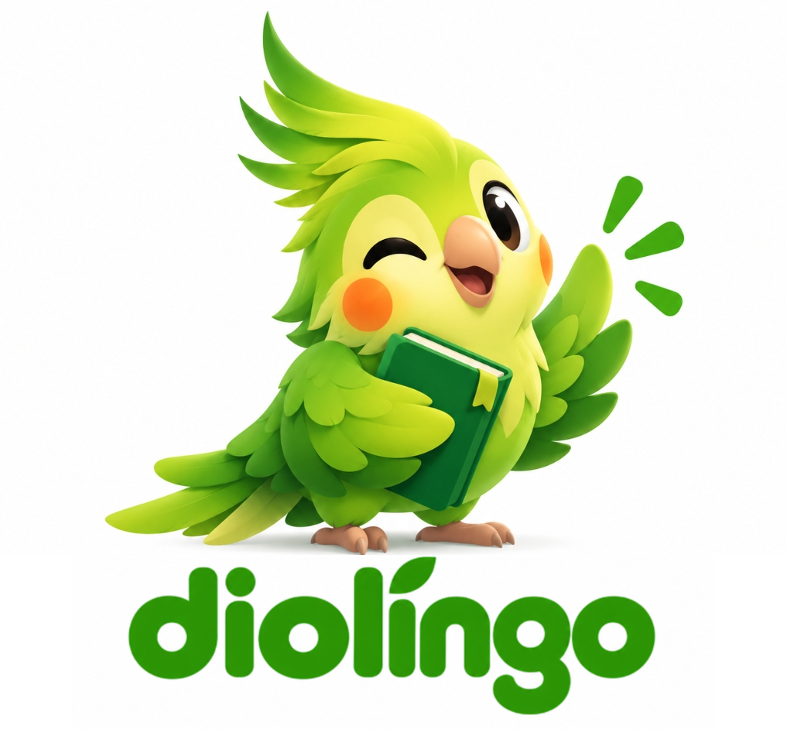
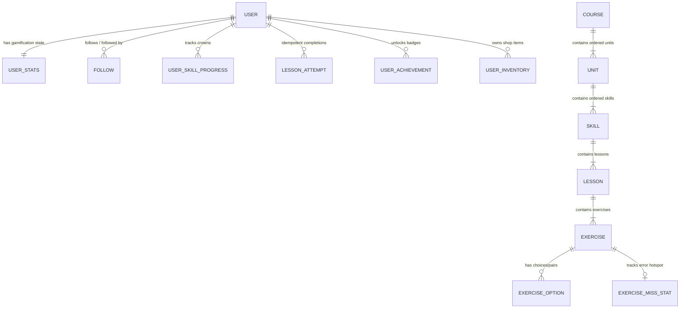

# Diolingo — Full-Feature Language Learning Platform

<p align="center">
  
</p>

> **Educational / Portfolio Project — Non-Commercial Use Only**  
> **Diolingo** is an educational full-stack implementation of a gamified language-learning platform built with **Next.js 14 (TypeScript)** and **Python FastAPI + SQLAlchemy 2.0**. It features our original cockatiel mascot **Dio**, original course content, and full mobile-ready REST API parity. Not affiliated with, sponsored by, or endorsed by Duolingo, Inc.

---

## 1. Quick Start & Setup Instructions

### Prerequisites
- **Python 3.11+**
- **Node.js 18+ & npm**

### Step 1: Start the Python FastAPI Backend (`port 8000`)
```bash
cd backend
pip install -r requirements.txt
python seed.py
python -m uvicorn app.main:app --host 0.0.0.0 --port 8000 --reload
```
- **Interactive OpenAPI / Swagger UI:** `http://localhost:8000/docs`
- **OpenAPI JSON Schema:** `http://localhost:8000/openapi.json`
- **Health Check Endpoint:** `http://localhost:8000/health`

### Step 2: Start the Next.js Frontend (`port 3000`)
```bash
cd frontend
npm install
npm run dev
```
Open **`http://localhost:3000`** in your browser.
- The app automatically logs into the pre-seeded **Guest Learner (`guest@diolingo.edu`)** account so graders can test every feature immediately without login friction.
- Use the **Quick Grader Switcher** in the bottom-left sidebar to switch between **🐣 Guest Demo (`guest@diolingo.edu`)** and **🛡️ Admin Studio (`admin@diolingo.edu`)** in one click.

### Step 3: Run Automated Test Suite (`pytest`)
```bash
cd backend
python -m pytest tests/test_gamification.py -v
```

---

## 2. Architecture & Relational Database Schema (ERD)

The relational database schema is built with **SQLAlchemy 2.0** (`backend/app/models.py`) so migrating from local SQLite (`sqlite:///./diolingo.db`) to PostgreSQL (`postgresql+psycopg://...`) is a single `DATABASE_URL` environment variable change.



---

## 3. Feature Coverage Matrix (P1 / P2 / P3)

| Spec Ref | Requirement | Priority | Status |
|---|---|---|---|
| **IV.1** | Email/Password registration & login (`bcrypt`), Guest Learner auto-login, Profile & Settings, OAuth 2.0 stubs | **P1 / P2** | ✅ Implemented |
| **IV.2** | Winding vertical skill path (`locked`, `available`, `active`, `completed`, `legendary`), persistent top status bar, 7 exercise types (`multiple_choice`, `word_bank`, `match_pairs`, `fill_blank`, `type_answer`, `listening`, `speaking`), Unit Checkpoints & Grammar Guidebooks | **P1 / P2** | ✅ Implemented |
| **IV.3** | Relational Course → Unit → Skill → Lesson → Exercise → Option schema, deterministic `seed.py`, Admin authoring UI & Bulk JSON/CSV content importer | **P1 / P2 / P3** | ✅ Implemented |
| **IV.4** | Server-side XP math + 2x XP Boost multiplier, injectable-clock Streak day-boundary engine, Streak Freeze, Hearts cap (5) + 4h regeneration + Out-of-Hearts modal, Weekly Leagues (`Bronze`, `Silver`, `Gold`), Badges shelf | **P1 / P2 / P3** | ✅ Implemented |
| **IV.5** | Gem Shop (`streak_freeze`, `xp_boost`, `heart_refill`, 3 Dio Mascot Outfits) + `"Super Diolingo"` educational paywall preview | **P2 / P3** | ✅ Implemented |
| **IV.6** | Self-referential `Follow` friend graph, Global vs. Friends Leaderboard toggle, Shareable Leaderboard Summary Card | **P2 / P3** | ✅ Implemented |
| **IV.7** | Admin Studio KPIs, 7-day activity trend, Lesson Completion Funnel, Most-Missed Exercises table, User Manager, Bug/Feedback Intake Queue | **P2 / P3** | ✅ Implemented |
| **IV.8** | Mobile-ready REST API parity, OpenAPI `/docs`, rate-limiting middleware, standardized `{ "error": { "code", "message" } }` envelope | **P1 / P2** | ✅ Implemented |

---

## 4. Production Deployment Guide (Render + Vercel — 100% Free Tier)

### A. Deploy Backend on Render (Free Tier)
1. Log in to [Render.com](https://render.com).
2. Click **New +** → **Web Service** (or **Blueprint** using the included `render.yaml`).
3. Connect your GitHub repository: `https://github.com/Anurag-gang/Diolingo-scalerAI-Assignment.git`.
4. Configure service settings:
   - **Name:** `diolingo-backend`
   - **Root Directory:** `backend`
   - **Runtime:** `Python 3`
   - **Build Command:** `pip install -r requirements.txt`
   - **Start Command:** `uvicorn app.main:app --host 0.0.0.0 --port $PORT`
   - **Plan:** `Free` ($0/mo)
5. Click **Deploy Web Service**.
6. Once deployed, copy your live backend URL (e.g., `https://diolingo-backend-xxxx.onrender.com`).
   - Health check: `https://diolingo-backend-xxxx.onrender.com/health`
   - Interactive Swagger API: `https://diolingo-backend-xxxx.onrender.com/docs`

### B. Deploy Frontend on Vercel (Free Tier)
1. Log in to [Vercel.com](https://vercel.com).
2. Click **Add New…** → **Project**.
3. Import the GitHub repository: `Anurag-gang/Diolingo-scalerAI-Assignment`.
4. In the Project Configuration:
   - **Root Directory:** Click **Edit** and select `frontend`.
   - **Framework Preset:** `Next.js` (auto-detected).
5. Under **Environment Variables**, add:
   - `NEXT_PUBLIC_API_URL` = `https://diolingo-backend-xxxx.onrender.com` (your live Render backend URL).
6. Click **Deploy**.
7. In ~60 seconds, your Diolingo frontend is live on edge CDN with automatic HTTPS!

---

# Diolingo-scalerAI-Assignment

